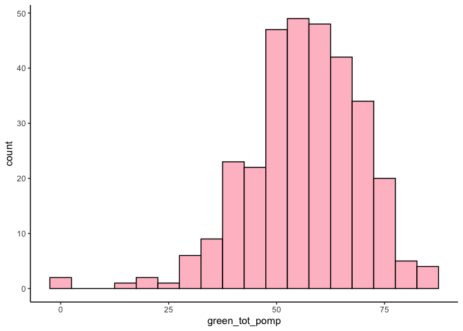
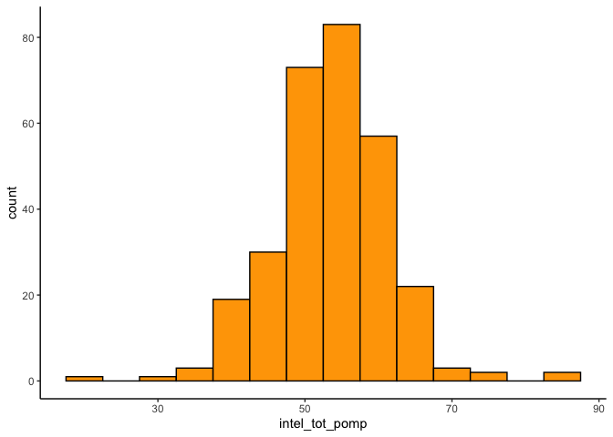
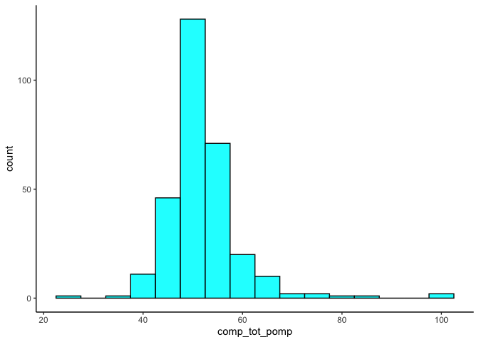
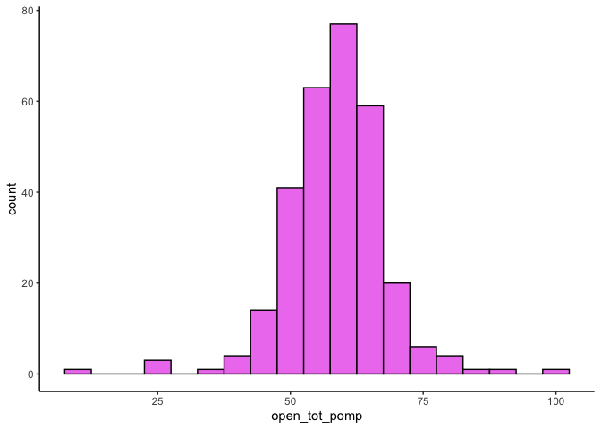
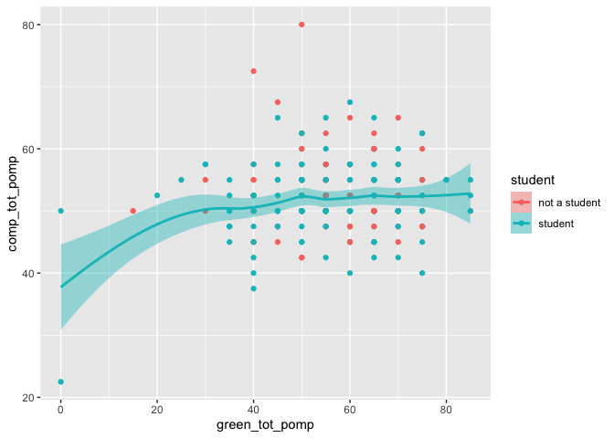
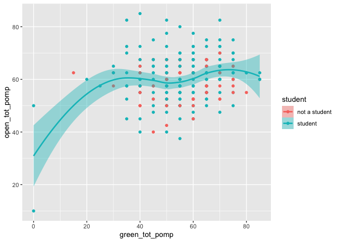
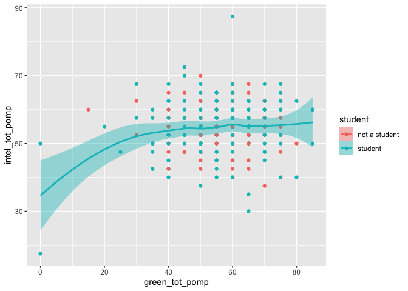

HW\_3
================
Antonietta
2/23/2021

# Homework 03

You will analyze data looking at the relationship between **green
reputation** and three personality traits–**compassion**, **intellectual
curiosity**, and **openness to experiences**. The dataset includes data
from **students** and **non-students**.

``` r
dictionary <- readr::read_csv("green_dictionary.csv")
```

    ## 
    ## ── Column specification ────────────────────────────────────────────────────────
    ## cols(
    ##   Item = col_character(),
    ##   Content = col_character(),
    ##   Options = col_character(),
    ##   Keying = col_double()
    ## )

``` r
green_data <- readr::read_csv("green_data.csv")
```

    ## 
    ## ── Column specification ────────────────────────────────────────────────────────
    ## cols(
    ##   .default = col_double(),
    ##   id = col_character()
    ## )
    ## ℹ Use `spec()` for the full column specifications.

For your assignment, do the following.

1.  Inspect the item responses (e.g., with graphs or by summarizing
    distinct values). Is anything unusual?

<!-- end list -->

``` r
print(green_data)  #The -99 is unusual 
```

    ## # A tibble: 373 x 37
    ##    id    green1 green2 green3 green4 green5 comp1 comp2 comp3 comp4 comp5 comp6
    ##    <chr>  <dbl>  <dbl>  <dbl>  <dbl>  <dbl> <dbl> <dbl> <dbl> <dbl> <dbl> <dbl>
    ##  1 9099       4      2      5      4      3     2     5     4     4     2     2
    ##  2 6275       3      5      3      3      1     4     5     4     5     5     1
    ##  3 8116       4      2      5      4      3     4     5     5     4     5     1
    ##  4 8586       4      3      5      4      3     4     5     5     4     5     1
    ##  5 0406       3      2      4      4      4     4     4     4     4     4     2
    ##  6 5645       4      3      4      4      3     5     5     5     4     4     2
    ##  7 3788       1      1      1      1      1     3     3     3     3     3     3
    ##  8 8424       4      3      2      2      2     1     1     1     2     2     4
    ##  9 8450       4      2      3      5      2     4     4     4     4     4     1
    ## 10 0512       4      2      5      5      4     5     2     5     4     2     2
    ## # … with 363 more rows, and 25 more variables: comp7 <dbl>, comp8 <dbl>,
    ## #   comp9 <dbl>, comp10 <dbl>, intel1 <dbl>, intel2 <dbl>, intel3 <dbl>,
    ## #   intel4 <dbl>, intel5 <dbl>, intel6 <dbl>, intel7 <dbl>, intel8 <dbl>,
    ## #   intel9 <dbl>, intel10 <dbl>, open1 <dbl>, open2 <dbl>, open3 <dbl>,
    ## #   open4 <dbl>, open5 <dbl>, open6 <dbl>, open7 <dbl>, open8 <dbl>,
    ## #   open9 <dbl>, open10 <dbl>, student <dbl>

``` r
reversed <- dictionary %>%
  filter(Keying == -1) %>%
  pull(Item)

new_green_data <- green_data %>%
mutate(
  across(everything(),
 ~na_if(.x , "-99")))
 
 #The min. value of -99 is now replaced with 1, and all the -99 are NA 

summary(new_green_data) 
```

    ##       id                green1          green2         green3     
    ##  Length:373         Min.   :1.000   Min.   :1.00   Min.   :1.000  
    ##  Class :character   1st Qu.:3.000   1st Qu.:2.00   1st Qu.:3.000  
    ##  Mode  :character   Median :4.000   Median :3.00   Median :4.000  
    ##                     Mean   :3.476   Mean   :2.93   Mean   :3.797  
    ##                     3rd Qu.:4.000   3rd Qu.:4.00   3rd Qu.:4.000  
    ##                     Max.   :5.000   Max.   :5.00   Max.   :5.000  
    ##                     NA's   :58      NA's   :58     NA's   :58     
    ##      green4          green5          comp1           comp2      
    ##  Min.   :1.000   Min.   :1.000   Min.   :1.000   Min.   :1.000  
    ##  1st Qu.:3.000   1st Qu.:2.000   1st Qu.:4.000   1st Qu.:4.000  
    ##  Median :3.000   Median :3.000   Median :4.000   Median :4.000  
    ##  Mean   :3.238   Mean   :2.835   Mean   :4.007   Mean   :4.051  
    ##  3rd Qu.:4.000   3rd Qu.:4.000   3rd Qu.:4.000   3rd Qu.:4.750  
    ##  Max.   :5.000   Max.   :5.000   Max.   :5.000   Max.   :5.000  
    ##  NA's   :58      NA's   :58      NA's   :87      NA's   :79     
    ##      comp3           comp4           comp5           comp6      
    ##  Min.   :1.000   Min.   :1.000   Min.   :1.000   Min.   :1.000  
    ##  1st Qu.:4.000   1st Qu.:4.000   1st Qu.:4.000   1st Qu.:2.000  
    ##  Median :4.000   Median :4.000   Median :4.000   Median :2.000  
    ##  Mean   :4.267   Mean   :4.049   Mean   :4.042   Mean   :2.161  
    ##  3rd Qu.:5.000   3rd Qu.:4.000   3rd Qu.:4.000   3rd Qu.:3.000  
    ##  Max.   :5.000   Max.   :5.000   Max.   :5.000   Max.   :5.000  
    ##  NA's   :77      NA's   :86      NA's   :90      NA's   :81     
    ##      comp7           comp8           comp9           comp10     
    ##  Min.   :1.000   Min.   :1.000   Min.   :1.000   Min.   :1.000  
    ##  1st Qu.:2.000   1st Qu.:2.000   1st Qu.:2.000   1st Qu.:1.000  
    ##  Median :2.000   Median :2.000   Median :2.000   Median :2.000  
    ##  Mean   :2.192   Mean   :2.096   Mean   :2.053   Mean   :1.933  
    ##  3rd Qu.:3.000   3rd Qu.:2.000   3rd Qu.:2.000   3rd Qu.:2.000  
    ##  Max.   :5.000   Max.   :5.000   Max.   :5.000   Max.   :5.000  
    ##  NA's   :87      NA's   :91      NA's   :91      NA's   :90     
    ##      intel1          intel2          intel3          intel4     
    ##  Min.   :1.000   Min.   :1.000   Min.   :1.000   Min.   :1.000  
    ##  1st Qu.:3.000   1st Qu.:3.000   1st Qu.:3.000   1st Qu.:3.000  
    ##  Median :4.000   Median :4.000   Median :4.000   Median :4.000  
    ##  Mean   :3.728   Mean   :3.699   Mean   :3.537   Mean   :3.375  
    ##  3rd Qu.:4.000   3rd Qu.:4.000   3rd Qu.:4.000   3rd Qu.:4.000  
    ##  Max.   :5.000   Max.   :5.000   Max.   :5.000   Max.   :5.000  
    ##  NA's   :79      NA's   :91      NA's   :88      NA's   :90     
    ##      intel5          intel6          intel7          intel8     
    ##  Min.   :1.000   Min.   :1.000   Min.   :1.000   Min.   :1.000  
    ##  1st Qu.:3.000   1st Qu.:3.000   1st Qu.:2.000   1st Qu.:2.000  
    ##  Median :4.000   Median :4.000   Median :2.000   Median :2.000  
    ##  Mean   :3.725   Mean   :3.572   Mean   :2.455   Mean   :2.469  
    ##  3rd Qu.:4.000   3rd Qu.:4.000   3rd Qu.:3.000   3rd Qu.:3.000  
    ##  Max.   :5.000   Max.   :5.000   Max.   :5.000   Max.   :5.000  
    ##  NA's   :78      NA's   :90      NA's   :87      NA's   :79     
    ##      intel9         intel10          open1           open2      
    ##  Min.   :1.000   Min.   :1.000   Min.   :1.000   Min.   :1.000  
    ##  1st Qu.:2.000   1st Qu.:2.000   1st Qu.:4.000   1st Qu.:3.000  
    ##  Median :2.000   Median :2.000   Median :4.000   Median :4.000  
    ##  Mean   :2.733   Mean   :2.527   Mean   :4.247   Mean   :3.763  
    ##  3rd Qu.:4.000   3rd Qu.:3.000   3rd Qu.:5.000   3rd Qu.:4.000  
    ##  Max.   :5.000   Max.   :5.000   Max.   :5.000   Max.   :5.000  
    ##  NA's   :92      NA's   :92      NA's   :82      NA's   :82     
    ##      open3           open4          open5          open6           open7      
    ##  Min.   :1.000   Min.   :1.00   Min.   :1.00   Min.   :1.000   Min.   :1.000  
    ##  1st Qu.:3.000   1st Qu.:3.00   1st Qu.:3.00   1st Qu.:3.000   1st Qu.:2.000  
    ##  Median :4.000   Median :4.00   Median :4.00   Median :4.000   Median :3.000  
    ##  Mean   :3.749   Mean   :3.92   Mean   :3.83   Mean   :3.592   Mean   :2.983  
    ##  3rd Qu.:4.000   3rd Qu.:5.00   3rd Qu.:4.00   3rd Qu.:4.000   3rd Qu.:4.000  
    ##  Max.   :5.000   Max.   :5.00   Max.   :5.00   Max.   :5.000   Max.   :5.000  
    ##  NA's   :90      NA's   :86     NA's   :90     NA's   :86      NA's   :87     
    ##      open8           open9           open10        student     
    ##  Min.   :1.000   Min.   :1.000   Min.   :1.00   Min.   :1.000  
    ##  1st Qu.:2.000   1st Qu.:2.000   1st Qu.:2.00   1st Qu.:1.000  
    ##  Median :2.000   Median :2.000   Median :2.00   Median :2.000  
    ##  Mean   :2.599   Mean   :2.568   Mean   :2.72   Mean   :1.671  
    ##  3rd Qu.:3.000   3rd Qu.:4.000   3rd Qu.:4.00   3rd Qu.:2.000  
    ##  Max.   :5.000   Max.   :5.000   Max.   :5.00   Max.   :2.000  
    ##  NA's   :84      NA's   :77      NA's   :91     NA's   :96

``` r
#   ~ says that you are going to use the .x symbol , .x marks the spot 
# 'everything()' = ALL COLUMNS 
# .missing is for when you look for missing values 
# NA is for when this is missing 
# .x = the current column 
```

2.  Compute total scores for the four scales. Recode variables as
    needed.

<!-- end list -->

``` r
#We will be recoding variables to make them more concrete and easier to read 

 new_green_data %>%
  rowwise() %>% 
  mutate(green_tot = sum(c_across(green1:green5), na.rm = TRUE),
         comp_tot = sum(c_across(comp1:comp10), na.rm = TRUE),
         intel_tot = sum(c_across(intel1:intel10), na.rm =TRUE),
         open_tot = sum(c_across(open1:open10), na.rm = TRUE)
   )
```

    ## # A tibble: 373 x 41
    ## # Rowwise: 
    ##    id    green1 green2 green3 green4 green5 comp1 comp2 comp3 comp4 comp5 comp6
    ##    <chr>  <dbl>  <dbl>  <dbl>  <dbl>  <dbl> <dbl> <dbl> <dbl> <dbl> <dbl> <dbl>
    ##  1 9099       4      2      5      4      3     2     5     4     4     2     2
    ##  2 6275       3      5      3      3      1     4     5     4     5     5     1
    ##  3 8116       4      2      5      4      3     4     5     5     4     5     1
    ##  4 8586       4      3      5      4      3     4     5     5     4     5     1
    ##  5 0406       3      2      4      4      4     4     4     4     4     4     2
    ##  6 5645       4      3      4      4      3     5     5     5     4     4     2
    ##  7 3788       1      1      1      1      1     3     3     3     3     3     3
    ##  8 8424       4      3      2      2      2     1     1     1     2     2     4
    ##  9 8450       4      2      3      5      2     4     4     4     4     4     1
    ## 10 0512       4      2      5      5      4     5     2     5     4     2     2
    ## # … with 363 more rows, and 29 more variables: comp7 <dbl>, comp8 <dbl>,
    ## #   comp9 <dbl>, comp10 <dbl>, intel1 <dbl>, intel2 <dbl>, intel3 <dbl>,
    ## #   intel4 <dbl>, intel5 <dbl>, intel6 <dbl>, intel7 <dbl>, intel8 <dbl>,
    ## #   intel9 <dbl>, intel10 <dbl>, open1 <dbl>, open2 <dbl>, open3 <dbl>,
    ## #   open4 <dbl>, open5 <dbl>, open6 <dbl>, open7 <dbl>, open8 <dbl>,
    ## #   open9 <dbl>, open10 <dbl>, student <dbl>, green_tot <dbl>, comp_tot <dbl>,
    ## #   intel_tot <dbl>, open_tot <dbl>

``` r
print(new_green_data
      )
```

    ## # A tibble: 373 x 37
    ##    id    green1 green2 green3 green4 green5 comp1 comp2 comp3 comp4 comp5 comp6
    ##    <chr>  <dbl>  <dbl>  <dbl>  <dbl>  <dbl> <dbl> <dbl> <dbl> <dbl> <dbl> <dbl>
    ##  1 9099       4      2      5      4      3     2     5     4     4     2     2
    ##  2 6275       3      5      3      3      1     4     5     4     5     5     1
    ##  3 8116       4      2      5      4      3     4     5     5     4     5     1
    ##  4 8586       4      3      5      4      3     4     5     5     4     5     1
    ##  5 0406       3      2      4      4      4     4     4     4     4     4     2
    ##  6 5645       4      3      4      4      3     5     5     5     4     4     2
    ##  7 3788       1      1      1      1      1     3     3     3     3     3     3
    ##  8 8424       4      3      2      2      2     1     1     1     2     2     4
    ##  9 8450       4      2      3      5      2     4     4     4     4     4     1
    ## 10 0512       4      2      5      5      4     5     2     5     4     2     2
    ## # … with 363 more rows, and 25 more variables: comp7 <dbl>, comp8 <dbl>,
    ## #   comp9 <dbl>, comp10 <dbl>, intel1 <dbl>, intel2 <dbl>, intel3 <dbl>,
    ## #   intel4 <dbl>, intel5 <dbl>, intel6 <dbl>, intel7 <dbl>, intel8 <dbl>,
    ## #   intel9 <dbl>, intel10 <dbl>, open1 <dbl>, open2 <dbl>, open3 <dbl>,
    ## #   open4 <dbl>, open5 <dbl>, open6 <dbl>, open7 <dbl>, open8 <dbl>,
    ## #   open9 <dbl>, open10 <dbl>, student <dbl>

3.  Rescale the variables so that they go from 0-100 instead of the
    original range. Name the rescaled variables `*_pomp`.

<!-- end list -->

``` r
ng_data <- new_green_data %>% 
   mutate(across
          (c(green1:open10),
             ~ recode(.x, "1" = 0, "2" = 25, "3" = 50, "4" = 75, "5" = 100),
                           .names = "{.col}_pomp")
                          )

  ng_data <- ng_data %>% 
  rowwise() %>% 
  mutate(
    green_tot_pomp = 
      mean(
      c_across(green1_pomp:green5_pomp), na.rm = TRUE),
    comp_tot_pomp = 
      mean(
           c_across(comp1_pomp:comp10_pomp), na.rm = TRUE),
    intel_tot_pomp = 
      mean(
           c_across(intel1_pomp:intel10_pomp), na.rm = TRUE),
    open_tot_pomp = 
      mean(
           c_across(open1_pomp:open10_pomp), na.rm = TRUE))
  
  ng_data$student <- recode_factor(ng_data$student, "1" = "not a student", "2" = "student", .default = NULL)
  
  print(ng_data)
```

    ## # A tibble: 373 x 76
    ## # Rowwise: 
    ##    id    green1 green2 green3 green4 green5 comp1 comp2 comp3 comp4 comp5 comp6
    ##    <chr>  <dbl>  <dbl>  <dbl>  <dbl>  <dbl> <dbl> <dbl> <dbl> <dbl> <dbl> <dbl>
    ##  1 9099       4      2      5      4      3     2     5     4     4     2     2
    ##  2 6275       3      5      3      3      1     4     5     4     5     5     1
    ##  3 8116       4      2      5      4      3     4     5     5     4     5     1
    ##  4 8586       4      3      5      4      3     4     5     5     4     5     1
    ##  5 0406       3      2      4      4      4     4     4     4     4     4     2
    ##  6 5645       4      3      4      4      3     5     5     5     4     4     2
    ##  7 3788       1      1      1      1      1     3     3     3     3     3     3
    ##  8 8424       4      3      2      2      2     1     1     1     2     2     4
    ##  9 8450       4      2      3      5      2     4     4     4     4     4     1
    ## 10 0512       4      2      5      5      4     5     2     5     4     2     2
    ## # … with 363 more rows, and 64 more variables: comp7 <dbl>, comp8 <dbl>,
    ## #   comp9 <dbl>, comp10 <dbl>, intel1 <dbl>, intel2 <dbl>, intel3 <dbl>,
    ## #   intel4 <dbl>, intel5 <dbl>, intel6 <dbl>, intel7 <dbl>, intel8 <dbl>,
    ## #   intel9 <dbl>, intel10 <dbl>, open1 <dbl>, open2 <dbl>, open3 <dbl>,
    ## #   open4 <dbl>, open5 <dbl>, open6 <dbl>, open7 <dbl>, open8 <dbl>,
    ## #   open9 <dbl>, open10 <dbl>, student <fct>, green1_pomp <dbl>,
    ## #   green2_pomp <dbl>, green3_pomp <dbl>, green4_pomp <dbl>, green5_pomp <dbl>,
    ## #   comp1_pomp <dbl>, comp2_pomp <dbl>, comp3_pomp <dbl>, comp4_pomp <dbl>,
    ## #   comp5_pomp <dbl>, comp6_pomp <dbl>, comp7_pomp <dbl>, comp8_pomp <dbl>,
    ## #   comp9_pomp <dbl>, comp10_pomp <dbl>, intel1_pomp <dbl>, intel2_pomp <dbl>,
    ## #   intel3_pomp <dbl>, intel4_pomp <dbl>, intel5_pomp <dbl>, intel6_pomp <dbl>,
    ## #   intel7_pomp <dbl>, intel8_pomp <dbl>, intel9_pomp <dbl>,
    ## #   intel10_pomp <dbl>, open1_pomp <dbl>, open2_pomp <dbl>, open3_pomp <dbl>,
    ## #   open4_pomp <dbl>, open5_pomp <dbl>, open6_pomp <dbl>, open7_pomp <dbl>,
    ## #   open8_pomp <dbl>, open9_pomp <dbl>, open10_pomp <dbl>,
    ## #   green_tot_pomp <dbl>, comp_tot_pomp <dbl>, intel_tot_pomp <dbl>,
    ## #   open_tot_pomp <dbl>

4.  Make plots that illustrate the distributions of the 4 POMP-scored
    variables.

<!-- end list -->

``` r
ggplot(ng_data) +
  aes(green_tot_pomp) +
  geom_histogram( binwidth = 5, 
                  fill = "pink" , 
                  col = "black")+
  theme_classic()
```

    ## Warning: Removed 58 rows containing non-finite values (stat_bin).

<!-- -->

``` r
ggplot(ng_data) +
  aes(intel_tot_pomp) +
  geom_histogram(binwidth = 5 , fill = 
                   "orange", 
                 col = "black")+
  theme_classic()
```

    ## Warning: Removed 77 rows containing non-finite values (stat_bin).

<!-- -->

``` r
ggplot(ng_data) +
  aes(comp_tot_pomp) +
  geom_histogram(binwidth = 5, 
                 fill = "cyan", 
                 col = "black")+
  theme_classic()
```

    ## Warning: Removed 77 rows containing non-finite values (stat_bin).

<!-- -->

``` r
ggplot(ng_data) +
  aes(open_tot_pomp) +
  geom_histogram(binwidth = 5,
                 fill = "violet", 
                 col = "black")+
  theme_classic()
```

    ## Warning: Removed 77 rows containing non-finite values (stat_bin).

<!-- -->

The histograms show that all the variables are roughly normally
distributed. The green reputation total variable seems to be slightly
negatively skewed.

5.  Make scatterplots showing the relationships between **green
    reputation** and each personality trait. Include trend lines for
    **students** and **non-students**. What do these plots show?

<!-- end list -->

``` r
ggplot(na.omit(ng_data)) +
  aes( x = green_tot_pomp ,
       y = comp_tot_pomp ,
       fill = student , 
       color = student) +
  geom_point() +
  geom_smooth(data = subset(ng_data, student == "NonStudent" 
                            | student == "student"))
```

    ## `geom_smooth()` using method = 'loess' and formula 'y ~ x'

<!-- -->

``` r
ggplot(na.omit(ng_data)) +
  aes( x =green_tot_pomp ,
       y = open_tot_pomp ,
       fill = student , 
       color = student) +
  geom_point() +
  geom_smooth(data = subset(ng_data , student == "NonStudent" 
                            | student == "student"))
```

    ## `geom_smooth()` using method = 'loess' and formula 'y ~ x'

<!-- -->

``` r
ggplot(na.omit(ng_data)) +
  aes( x = green_tot_pomp ,
       y = intel_tot_pomp ,
       fill = student , 
       color = student) +
  geom_point() +
  geom_smooth(data = subset(ng_data , student == "NonStudent" 
                            | student == "student"))
```

    ## `geom_smooth()` using method = 'loess' and formula 'y ~ x'

<!-- -->

The rainfall plots show that students had slightly higher scores than
non-students across the measures, however no-students seemed to have
higher scores regarding green reputation

6.  Compare **green reputation** for students and non-students using a
    **rainfall plot** (bar + density + data points).

<!-- end list -->

``` r
ggplot(na.omit(ng_data)) +
  aes( x = green_tot_pomp , 
       y = student , 
       color = student) +
  geom_jitter( height = .20)+
  geom_boxplot(color = "violet",
               alpha = .5 ,
               width = .1 , 
               size = .5 ) +  
  ggdist::stat_slab(
                    height = .3,
                    color ="green",
                    size = .2 ,
                    alpha = .5 ,
                    position = position_nudge( y = .5)
                    )
```

<!-- -->

This plot sows that students seem to have lower green reputation scores
than non-students.

7.  Compute a summary table of means, SDs, medians, minima, and maxima
    for the four total scores for students and non-students.

<!-- end list -->

``` r
ng_data %>%
  group_by(student) %>%
  summarize(across(c(green_tot_pomp, comp_tot_pomp, intel_tot_pomp, open_tot_pomp),
            list(
              mean = ~mean(.x , na.rm = TRUE),
              SD = ~sd(.x , na.rm =  TRUE), 
              median = ~median(.x , na.rm =  TRUE),
              minima = ~min(.x, na.rm =  TRUE), 
              mxima = ~max(.x, na.rm = TRUE)
            )))
```

    ## # A tibble: 3 x 21
    ##   student green_tot_pomp_… green_tot_pomp_… green_tot_pomp_… green_tot_pomp_…
    ## * <fct>              <dbl>            <dbl>            <dbl>            <dbl>
    ## 1 not a …             56.8             12.0             60                 15
    ## 2 student             56.0             13.4             55                  0
    ## 3 <NA>                57.2             14.3             57.5               20
    ## # … with 16 more variables: green_tot_pomp_mxima <dbl>,
    ## #   comp_tot_pomp_mean <dbl>, comp_tot_pomp_SD <dbl>,
    ## #   comp_tot_pomp_median <dbl>, comp_tot_pomp_minima <dbl>,
    ## #   comp_tot_pomp_mxima <dbl>, intel_tot_pomp_mean <dbl>,
    ## #   intel_tot_pomp_SD <dbl>, intel_tot_pomp_median <dbl>,
    ## #   intel_tot_pomp_minima <dbl>, intel_tot_pomp_mxima <dbl>,
    ## #   open_tot_pomp_mean <dbl>, open_tot_pomp_SD <dbl>,
    ## #   open_tot_pomp_median <dbl>, open_tot_pomp_minima <dbl>,
    ## #   open_tot_pomp_mxima <dbl>

The summary shows that non-students score slightly higher than students
in total measures of green,comp, intel, but not in the open measure. In
regards to standar deviation, non-students was lower than for students
in the green, intel, and open measures, however, it was higher for the
comp measure. The median of green, and comp measures, however, the
medians for open, and intel were similar.  
Maximas were similar amongst students and non-students for green,but the
scores were higher for students in the measures of intel, and open.
Finally, for the minimas, the scores were higher for non-students across
all measures.

In your assignment, prepare an RMarkdown file that includes both the
coding and (for 4-7) narrative descriptions of your results.
